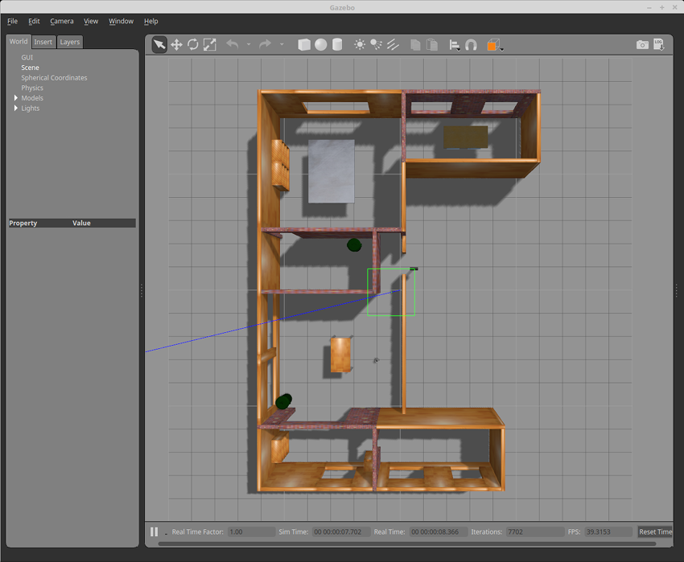
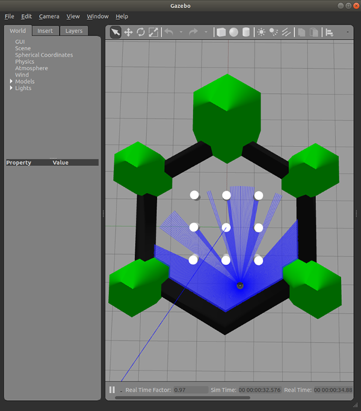

# Simulación TurtleBot3

Este repositorio contiene los paquetes necesarios para simular el robot TurtleBot3 en ROS 2 Humble, incluyendo entornos Gazebo y herramientas de navegación.

## Requisitos

- **ROS 2 Humble**
- **Gazebo** (instalado con ROS 2)
- **Sistema operativo**: Ubuntu 22.04 (recomendado)

## Instalación

1. Clonar este repositorio en tu workspace de ROS 2:

```bash
cd ~/ros2_ws/src
git clone https://github.com/Kalman-Robotics/kalman-turtlebot3.git
cd ~/ros2_ws
```

2. Instalar las dependencias:

```bash
sudo apt-get update
rosdep update
rosdep install --from-paths src --ignore-src -r -y
```

3. Compilar el workspace:

```bash
colcon build
source install/setup.bash
```

## Configuración

Antes de ejecutar la simulación, configurar el modelo del TurtleBot3:

```bash
export TURTLEBOT3_MODEL=burger
```

Puedes agregar esta línea a tu `~/.bashrc` para que sea permanente.

## Simulación

### Mundo básico (Empty World)

```bash
ros2 launch turtlebot3_gazebo empty_world.launch.py
```


### Casa (TurtleBot3 House)

```bash
ros2 launch turtlebot3_gazebo turtlebot3_house.launch.py
```



### Mundo de TurtleBot3

```bash
ros2 launch turtlebot3_gazebo turtlebot3_world.launch.py
```



## Teleoperación

Para controlar el robot con el teclado:

```bash
ros2 run turtlebot3_teleop teleop_keyboard
```

## Agradecimientos

- [ROBOTIS](https://github.com/ROBOTIS-GIT/turtlebot3) - Desarrolladores originales del TurtleBot3
- Comunidad de ROS 2

